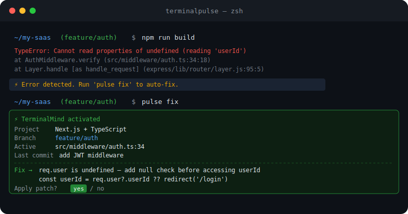

<div align="center">



---

# ⚡ TerminalPulse

***Short-term memory for AI agents. Captures your coding context in real time — silently.***

Detect errors, track your focus, and fix bugs instantly — no copy-pasting, no explaining, no context switching. TerminalPulse watches your terminal, editor, and filesystem. When something breaks, it already knows what happened.

---


&nbsp;

&nbsp;

&nbsp;

&nbsp;

&nbsp;

&nbsp;

&nbsp;


</div>

---

## 📋 Table of Contents

- [The Problem](#-the-problem-every-developer-knows)
- [The Solution](#-the-solution)
- [How It Works](#-how-it-works)
- [Installation](#-installation)
- [Setup](#-setup-one-time)
- [Commands](#-commands)
- [Real World Scenarios](#-real-world-scenarios)
- [Auto-Suggest on Error](#-auto-suggest-on-error)
- [MCP Integration](#-mcp-integration-claude-desktop--cursor)
- [Language & Project Support](#-language--project-support)
- [The Difference](#-the-difference)
- [Security & Privacy](#-security--privacy)
- [Requirements](#-requirements)
- [Tests](#-tests)
- [Contributing](#-contributing)
- [License](#-license)

---

## 🔥 The Problem Every Developer Knows

You're deep in a feature. Your build breaks. Now you have to:

1. Read the traceback
2. Copy the error
3. Switch to Claude / ChatGPT / Cursor
4. Explain your project, your git branch, which file you were editing
5. Paste the file contents
6. Wait for the answer
7. Switch back to terminal
8. Apply the fix manually

**That's 2 minutes of context-switching friction. Every. Single. Time.**

The worst part? The AI doesn't know anything about what you were doing. You have to re-explain everything from scratch.

---

## ✅ The Solution

```bash
# Your Next.js build breaks at 2am
npm run build
# TypeError: Cannot read properties of undefined (reading 'userId')
# ⚡ Error detected. Run 'pulse fix' to auto-fix.

pulse fix
# TerminalMind already knows:
# → Project: Next.js + TypeScript
# → Branch: feature/auth
# → Last commit: "add JWT middleware"
# → Active file: src/middleware/auth.ts
# → Full build error output
# → Actual file contents
# → Precise fix in seconds
```

No switching tabs. No explaining. No copy-pasting.

---

## 🏗️ How It Works

Three silent streams feed a time-decaying knowledge graph:

| Stream | Source | What It Captures |
|---|---|---|
| **Focus** | VS Code window title | Which file is active in your editor |
| **Activity** | Filesystem watchdog | Which files were just saved |
| **Distress** | Bash hook | Which terminal commands just failed |

Every event gets a heat score that decays over time:

```
heat = e^(-λ × seconds_since_event) × severity
```

Older events fade automatically. The AI always gets what's relevant **right now** — not noise from this morning's work.

### Data Flow

```
VS Code (Windows) → HTTP:7077  ─┐
Terminal errors   → Unix socket ─┼→ pulsed daemon → ~/.devpulse_state.json
File saves        → watchdog   ─┘                         ↓
                                          pulse fix → TerminalMind → Fix
```

### Technology Stack

| Layer | Technology | Role |
|---|---|---|
| **Daemon** | Python asyncio | Long-lived background process |
| **Graph** | NetworkX + Pydantic | Time-decaying knowledge graph |
| **CLI** | Typer + Rich | Commands and formatted output |
| **AI Bridge** | TerminalMind | Auto-fix powered by live context |

---

## 🚀 Installation

```bash
pip install terminalpulse
pip install terminalmind
tmind auth
```

---

## ⚙️ Setup (One Time)

```bash
# Install system dependencies
pulse install-deps

# Inject shell hook
pulse init
source ~/.bashrc

# Start watching your project
cd your-project
pulse watch
```

That's it. TerminalPulse runs silently in the background from now on.

---

## 🛠️ Commands

| Command | What It Does |
|---|---|
| `pulse watch` | Auto-detect project type and start daemon |
| `pulse fix` | Send full context to AI — no input needed |
| `pulse context` | Copy formatted context block for any AI |
| `pulse summary` | Plain English summary of your coding session |
| `pulse insights` | Detect recurring failure patterns |
| `pulse report` | End of day coding summary |
| `pulse history` | 30-minute activity timeline |
| `pulse state` | Show raw JSON context |
| `pulse init` | Inject shell hook into `.bashrc` |
| `pulse install-deps` | Install system dependencies |
| `pulse mcp` | Start MCP server for Claude Desktop / Cursor |
| `pulse_run <cmd>` | Capture full stderr for large builds |

---

## 🧑‍💻 Real World Scenarios

### Scenario 1 — Full-Stack Developer (Next.js + TypeScript)

```bash
cd ~/my-saas
pulse watch
# Project detected: Next.js + TypeScript
# Watching: /home/user/my-saas

# Later — build breaks
npm run build
# Module not found: Can't resolve '@/components/AuthGuard'
# ⚡ Error detected. Run 'pulse fix' to auto-fix.

pulse fix
# Sends to TerminalMind:
# → Project: Next.js + TypeScript
# → Branch: feature/dashboard
# → Changed files: components/AuthGuard.tsx, pages/dashboard.tsx
# → Full webpack error
# → File contents of dashboard.tsx
# → Precise fix instantly
```

---

### Scenario 2 — Backend Developer (Python / FastAPI)

```bash
cd ~/api-server
pulse watch
# Project detected: Python

# Server crashes
python3 main.py
# sqlalchemy.exc.OperationalError: no such table: users
# ⚡ Error detected. Run 'pulse fix' to auto-fix.

pulse fix
# AI knows you just edited models.py and ran a migration
# Gives exact Alembic fix, not a generic answer
```

---

### Scenario 3 — You Use Claude, Not TerminalMind

```bash
pulse context
# Copies to clipboard:
# === TerminalPulse Context ===
# Project:      React + TypeScript
# Branch:       fix/payment-flow
# Active file:  src/checkout/PaymentForm.tsx
# Last error:   npm run build (exit 1)
# Changed files: PaymentForm.tsx, useStripe.ts
# File contents: [actual code]
# =============================

# Paste into Claude — full context in one paste
```

---

### Scenario 4 — Recurring Bug Pattern

```bash
# After hitting the same error 4 times today
pulse insights

# ⚡ TerminalPulse Insights
# Project: Python | Branch: feature/auth
#
# Recurring failure: python3 server.py failed 4 times
# → All failures occurred after editing config.py
# → Suggestion: run pulse fix to investigate root cause
# High error rate: 80%
# → Consider adding input validation to config.py
```

---

### Scenario 5 — End of Day Standup

```bash
pulse report

# 📊 TerminalPulse Daily Report
# Branch: feature/payment-integration
#
# • Files saved:      23
# • Errors hit:        6
# • Focus changes:    14
#
# Most edited file:   PaymentForm.tsx (6 saves)
# Most common error:  npm run build (4x)
#
# Rough session — 6 errors. Run pulse insights for patterns.
```

---

### Scenario 6 — Quick Session Summary

```bash
pulse summary

# 📝 Session Summary
#
# You are working on a Python project on branch feature/auth.
# Most of your time was spent editing models.py (6 saves).
# Your active file right now is models.py.
# You hit 3 errors, most from python3 server.py (3x).
# Last commit: add user authentication
```

Useful when coming back after a break — instant context of where you left off.

```bash
# Real output example:
(terminalpulse) prajwal@Prajwal:~/terminalpulse$ pulse summary

📝 Session Summary

You are on branch master.
Most of your time was spent editing cli.py (1 save).
You hit 1 error(s) this session.
Last commit: v0.5.0 - graceful fallback, pulse context, auto-suggest, install-deps
```

---

## ⚡ Auto-Suggest on Error

Every time a command fails, TerminalPulse prints:

```
⚡ Error detected. Run 'pulse fix' to auto-fix.
```

You never have to remember to use it.

---

## 🔌 MCP Integration (Claude Desktop / Cursor)

```bash
pulse mcp
```

Add to `claude_desktop_config.json`:

```json
{
  "mcpServers": {
    "terminalpulse": {
      "command": "pulse",
      "args": ["mcp"]
    }
  }
}
```

Claude Desktop now has live access to your coding context. Ask it:
- *"What was I working on?"*
- *"What errors did I hit today?"*
- *"Which file is causing the most problems?"*

Available tools:

| Tool | Returns |
|---|---|
| `get_pulse_state` | Full current coding context |
| `get_hottest_error` | Most recent error with full stderr |
| `get_active_context` | Active file, language, git branch |
| `get_history` | Last 30 minutes timeline |

---

## 🌍 Language & Project Support

| Stack | Detection | Error Capture | Fix |
|---|---|---|---|
| Python / FastAPI / Django | ✓ | ✓ | ✓ |
| React / Next.js | ✓ | ✓ | ✓ |
| TypeScript / Node.js | ✓ | ✓ | ✓ |
| Rust | ✓ | ✓ | ✓ |
| Go | ✓ | ✓ | ✓ |
| Java / Spring | ✓ | ✓ | ✓ |
| Large builds (webpack, gradle, pytest) | ✓ via `pulse_run` | ✓ | ✓ |

---

## 📊 The Difference

| Without TerminalPulse | With TerminalPulse |
|---|---|
| Copy error manually | Auto-captured |
| Switch to AI chat | Already connected |
| Explain your project | Auto-detected |
| Explain git branch | Auto-detected |
| Paste file contents | Auto-read |
| Wait for response | Instant |
| Apply fix manually | One keypress |
| **~2 minutes every time** | **~5 seconds** |

---

## 🛡️ Security & Privacy

- **Local first** — your context graph lives entirely on your machine
- **No telemetry** — nothing is sent anywhere without your command
- **Targeted context** — only the specific error and active file go to the AI
- **Secure keys** — API keys stored in OS keyring, never in plain files

---

## 📋 Requirements

- Python 3.10+
- WSL Ubuntu (Linux daemon)
- `netcat` — pre-installed on Ubuntu
- `terminalmind` — for `pulse fix`
- Windows 11 + VS Code — for focus tracking (optional)

---

## 🧪 Tests

**29 unit tests — all passing.**

```bash
.venv/bin/pytest tests/ -v
# 29 passed in 0.83s
```

| Category | Tests | What's Verified |
|---|---|---|
| **Event model** | 4 | `COMMAND_FAILED`, `FILE_SAVED`, `FOCUS_CHANGED`, `COMMAND_OK` — correct fields & timestamps |
| **Language detection** | 8 | `.py` → python, `.ts` → typescript, `.tsx` → typescript, `.js` → javascript, `.rs` → rust, `.go` → go, unknown ext, `None` input |
| **Project type detection** | 8 | `pyproject.toml` → python, `requirements.txt` → python, `package.json` → react-typescript / nextjs / node, `Cargo.toml` → rust, `go.mod` → go, empty folder → unknown |
| **PulseGraph** | 9 | Events added to graph, heat scores 0–1, errors linked to active file, hottest events sorted by heat, state written to disk, history recorded |

---

## 🤝 Contributing

1. Fork the repository
2. Create your branch: `git checkout -b feature/your-feature`
3. Add tests for your feature — all PRs must include new tests covering new behaviour
4. Ensure all 29 existing tests still pass: `.venv/bin/pytest tests/ -v`
5. Commit: `git commit -m 'Add your feature'`
6. Push: `git push origin feature/your-feature`
7. Open a Pull Request

> PRs without passing tests will not be merged.

---
## 📝 Changelog

| Version | What's New |
|---|---|
| `v0.5.0` | `pulse summary`, graceful fallback, `pulse context`, auto-suggest on every error, `pulse install-deps`, 29 unit tests, demo screenshots |
| `v0.4.0` | MCP integration for Claude Desktop / Cursor |
| `v0.3.0` | `pulse insights`, `pulse report`, pattern detection |
| `v0.2.0` | `pulse fix`, TerminalMind bridge, Unix socket daemon |
| `v0.1.0` | Initial release — shell hook, file watcher, heat graph |

---
## 📄 License

MIT © 2026 Prajwal Hulle — See **[LICENSE](https://github.com/prajwal-2509/terminalpulse/blob/main/LICENSE)** for full details.

---

<div align="center">

Built for developers who are tired of copy-pasting errors into AI.

<br/>

[](https://pypi.org/project/terminalpulse)
&nbsp;
[](https://github.com/prajwal-2509/terminalpulse)
&nbsp;
[](https://github.com/prajwal-2509/terminalpulse/issues)

</div>
